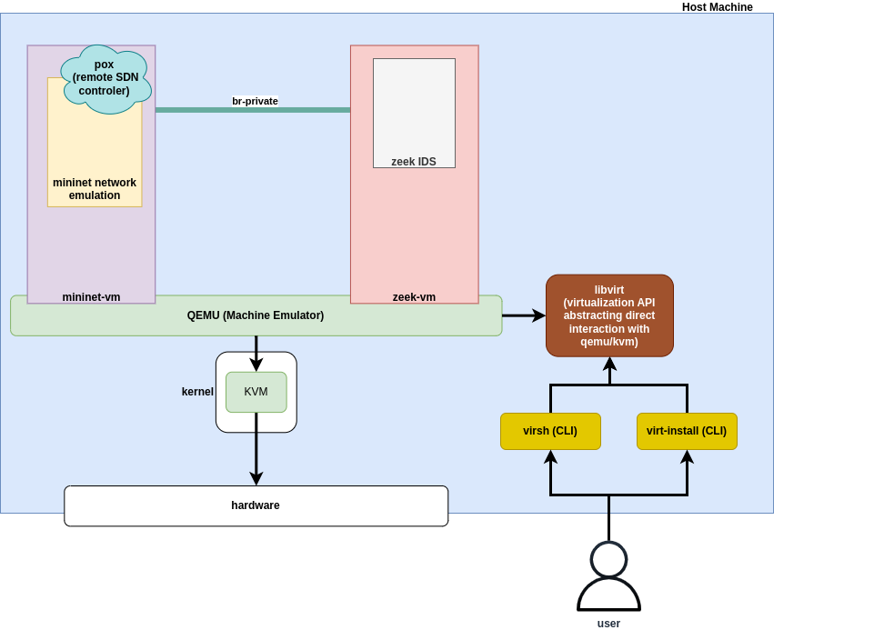

# KVM Environment Set-Up

The purpose of this setup is to simulate a Software Defined Network (SDN) with all the traffic in the network being mirrored to an Intrusion Detection System (IDS) based on [Zeek](https://zeek.org/) software. This IDS monitors the traffic and alerts the remote SDN controller in case of suspicious activity in the network, that in turn installs rules in the network elements to drop the potentially harmful traffic.

This automated approach to threat detection and mitigation ensures faster response times, maintaining network engineers focused on higher-level tasks such as development of detection and mitigation scripts and approaching a self-maintained / self-secured network utopia.

## Introduction

The environment is based on two virtual machines (`mininet-vm` and `zeek-vm`). As you might have guessed from the previous paragraphs the function of `zeek-vm` is to analyze traffic in real-time and communicate with the network controller. On the other hand there is `mininet-vm` based on the popular network emulator [mininet](http://mininet.org/), this machine will host the network emulation and the remote controller. All the traffic in the `mininet-vm` machine is mirrored to `zeek-vm` so that the latter can analyze and detect harmful traffic. Here is an illustration depicting the environment we built:



For this environment we use several tools and software, it will be presented below in installation order. Bash scripts for installation of software and networking settings of the environment are also provided, though it cannot be guaranteed that they work in one shot. Good understanding of each of the steps is important to ensure that your simulation environment works properly.

## Host machine
Our first intentions were to use an environment like the one described by [Ludwig Maximilian University of Munich MNM team](https://www.nm.ifi.lmu.de/mnmteam/index_en.php) in their [p4-sdn repository](https://github.com/mnm-team/p4-sdn/tree/main). However, due to hardware resource limitation of our device we opted for the more simple two-VM-only set-up. Here are the hardware specifications of our host-machine:

```bash
Dell Inspiron-5391
*-core
       description: Motherboard
       physical id: 0
     *-memory
          description: System memory
          physical id: 0
          size: 8064MiB
     *-cpu
          product: Intel(R) Core(TM) i7-10510U CPU @ 1.80GHz
          vendor: Intel Corp.
          physical id: 1
          bus info: cpu@0
          version: 6.142.12
          size: 3599MHz
          capacity: 4900MHz
          width: 64 bits
```
If your computer features 8GB or more memory you should be able to run this environment without any issues. You should check that the BIOS configuration of your computer has [virtualization support enabled](https://www.ninjaone.com/blog/how-to-enable-cpu-virtualization-in-your-computer-bios/) for CPU virtualization. Please also note that our computer used `Ubuntu 24.04` as OS, but the same environment can be achievable using [Windows Subsystem for Linux (WSL2)](https://learn.microsoft.com/en-us/windows/wsl/). Based on the instruction in this [programster blog](https://blog.programster.org/create-debian-12-kvm-guest-from-cloud-image) you should create two Debian12 based virtual machines (one `mininet-vm` and a second `zeek-vm`). To do so we present several bash scripts, which below are described.

The recommended settings for each machine are presented below:
```bash
zeek-vm
    - 4GB memory
    - 40GB storage

mininet-vm
    - 2GB memory
    - 40GB storage
```

1. First run bash script `1-vm-download.sh`, this will install all the necessary rules to run Kernel based Virtual Machines (KVM) in your system. It will also download a Debian 12 disk image and a `.php` script for machine configuration. It creates two copies of the image file to be used by the `zeek-vm` and the `mininet-vm` respectively. It also resizes the images according to the specifications above. You can always personalize your settings, please refer to the before mentioned programster blog. If this script runs successfully, now you will find a `generate.php` file in the directory where you ran the script. Open this file and search for this part, it should be within the first lines of the file:

```bash
# Specify the public keys of the private-keys you wish to login with.
$sshPublicKeys = [
    'ssh-rsa ...',
];
```

2. Copy and paste your public `.ssh` keys in between the single quote marks ('). Your `.ssh` public key is usually located in `~/.ssh/id_rsa.pub`, if this file is not in your system you might have to generate a `.ssh` key-pair yourself. Please refer to the step 1 in this [tutorial](https://phoenixnap.com/kb/generate-setup-ssh-key-ubuntu) to do so. The VM and output cloud disk image names will be modified with the next script, so you will probably will not see those modifications apply as you wish in case you change them. Save the modified file and you are ready to run the following script.

3. Run the second bash script `2-vm-settings.sh`, this script basically will generate two cloud disk images for both your Virtual Machines with the configuration specified by the `.php` script.

4. If the previous command succeeds to execute, you are good to go, now you just have to install each VM. We can start first by installing `zeek-vm`, run the following command:

```bash
sudo virt-install \
 --name zeek-vm \
 --memory 4096 \
 --disk zeek-debian12.qcow2,device=disk,bus=virtio \
 --disk zeek-cloud-init.iso,device=cdrom \
 --os-variant debian10 \
 --virt-type kvm \
 --graphics none \
 --network network=default,model=virtio \
 --import
```

5. The command should run for a while while it installs Debian-12 OS in the VM, when completed it should prompt you to login. You should login with `debian-debian` credential pair on the first time. Once logged in, you can run inside this `zeek-vm` the next bash script `3-user-creation.sh` which gives creates a user named res inside the VM and gives it the required rights.

6. After previous script is completed you should run `logout` command in the VM and log in again with the new created `res` user. You can now exit the VM with `Ctrl + 5`. 

7. (*Optional*) If you run `virsh net-dhcp-leases default` you should see what IP address has the default network assigned to your VM. If you run `ssh res@192.168.122.x` from your host machine you should be able to connect via the `ssh` protocol to the VM. If this does not work straight away it might mean that the SSH public key was not properly copied to the VM. There is an easy fix, follow the next steps:
    - Copy the public `ssh` key of your host machine (you can display it in your terminal running `cat ~/.ssh/id_rsa.pub`).
    - Connect to the VM via the `virsh console zeek-vm` command.
    - Create the `ssh` directory in the `res` user main directory (`mkdir ~/.ssh`).
    - Navigate inside the `ssh` directory and create a file named `authorized_keys` (`nano ~/.ssh/authorized_keys`).
    - Now paste the `ssh` public key from the host machine in this file, save it and exit. You should be able to `ssh` into the VM from your host machine now.

8. In your host machine you can now install the second VM. That is `mininet-vm`, by running the following command:

```bash
sudo virt-install \
 --name mininet-vm \
 --memory 2048 \
 --disk mininet-debian12.qcow2,device=disk,bus=virtio \
 --disk mininet-cloud-init.iso,device=cdrom \
 --os-variant debian10 \
 --virt-type kvm \
 --graphics none \
 --network network=default,model=virtio \
 --import
```

9. Repeat steps 5 to 7 to configure the `mininet-vm` this time.

## Virtual private bridge configuration between the two VMs

Next up, since we already have both Virtual Machines configured, we will set up a private virtual bridge which will enable both machines to communicate with each other directly, without making use of the default KVM network. This is useful to have for the traffic mirroring purpose, `mininet-vm` should mirror all the traffic through this bridge to `zeek-vm`. First of all you can shutdown both VMs by running `virsh destroy zeek-vm` and `virsh destroy mininet-vm` from your host-machine, then run the following commands to create a new bridge-type link named `br-private`. Thist two commands will have to be run every time you start your host-machine. If you want to make your configuration permanent, you can refer to this [link](https://ubuntu.com/server/docs/configuring-networks) on Static IP Assignment section.

```bash
ip link add br-private type bridge
ip link set dev br-private up
```

Now you can generate a random MAC address with the provided script `4-random-mac-generator.bash`, copy the generated MAC addresses to below XML code block for interface configuration in each of the VMs. Make sure that both address are different, otherwise both VM will not be able to communicate through the private virtual bridge.

```bash
<interface type='bridge'>
    <mac address='x:x:x:x:x:x'/>
    <source bridge='br-private'/>
    <model type='virtio'/>
</interface>
```

You can add the previous XML code block to `/etc/libvirt/qemu/zeek-vm.xml` and `/etc/libvirt/qemu/mininet-vm.xml` files, under the `default` network interface. THis will add the bridge to the default configuration of the two VMs.
```bash
<interface type='network'>
    <mac address='52:54:00:3c:a4:10'/>
    <source network='default' portid='f66dedc3-9111-41f2-8a49-0f90f302cfd2' bridge='virbr0'/>
    <target dev='vnet0'/>
    <model type='virtio'/>
    <alias name='net0'/>
    <address type='pci' domain='0x0000' bus='0x01' slot='0x00' function='0x0'/>
</interface>
## INSERT THE CODE SNIPPET FOR THE PRIVATE VIRTUAL BRIDGE WITH THE MAC ADDRESS HERE
<serial type='pty'>
    <source path='/dev/pts/1'/>
    <target type='isa-serial' port='0'>
    <model name='isa-serial'/>
    </target>
    <alias name='serial0'/>
</serial>
```

You can run `ip link show dev br-private` to confirm that the bridge is in UP status. If it is, start both VM with `virsh start zeek-vm` and `virsh start mininet-vm` and connect to both VMs (via `ssh` or `virsh console`). Login to `res` user and run `ip addr show` to check your VM's interfaces, you should usually only have three interfaces `lo` (loopback interface), `enp1s0` or some other name (interface to QEMU default network) and `enp7s0` or some other name (interface to the private virtual bridge, you can confirm by matching the MAC address to the one you added to the XML configuration file of the VM).

Next up, add an address to this virtual bridge interface with command `ip addr add 192.168.100.x dev enp7s0`. Each of the VMs should have a unique address, in our case:
```bash
zeek-vm: 192.168.100.2
mininet-vm: 192.168.100.3
```

Lastly, we need to create an entry in the routing tables of each of the VMs to forward packets through the private virtual bridge interfaces:
```bash
# in zeek-vm: 
ip route add 192.168.100.3 dev enp7s0

# in mininet-vm:
ip route add 192.168.100.2 dev enp7s0
```

Again the last two commands (adding address to interface and adding the routing table entry) will have to be run in every VM startup. You can refer to the Static IP Assignment section in the [link](https://ubuntu.com/server/docs/configuring-networks) provided earlier to make changes permanent.

Now you should be able to ping `mininet-vm` from `zeek-vm` and vice-versa. If that is not the case yet, you can also check that IP forwarding is active in each VM by running `sudo sysctl -w net.ipv4.ip_forward=1`. It is also interesting to keep this set in the system of each VM by editing the file `a` and uncomment the `net.ipv4.ip_forward=1` line.

## Conclusion

Up to this point networking settings for the expirement should be ready. You can move on to the directories [zeek-vm-setup](kvm-enviroment-setup/zeek-vm-setup/README.md) and [mininet-vm-setup](kvm-enviroment-setup/mininet-vm-setup/README.md) to follow the guide on software to install and mininet emulation interaction with the private bridge.