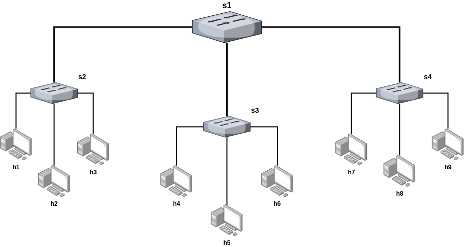
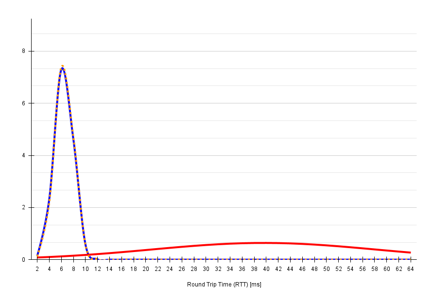

# Running a Mininet network emulation with Python scripts

This section briefly describes what is the architecture we chose for the emulation, how to mirror the traffic from the network to the Zeek VM, and how to generate different types of traffic in the emulation.

## Network architecture

The major constraint we were facing is to mirror the traffic from the network to the Zeek IDS service running in `zeek-vm`, in order to do this our approach was to mirror all the traffic from the gateway (or outermost) switch. Thus we decided to implement a tree-like topology, because we can use the outermost (or root) switch in the topology to mirror all the traffic in its ports through the private virtual bridge to `zeek-vm`. The topology is illustrated in the below figure.



It is a relatively large topology for a test-bed framework, but we think it can be very versatile for further research specially in the case of Distributed Denial of Service Attacks (DDoS), and also mimicking real network behavior. For example where one (or some) host is attacking a server within the network, the rest of the hosts within the network would also try to communicate normally with the server. With this topology we can generate all kinds of traffic from the different sources and destinations and perform measurements such as: detection and mitigation time, round trip delay (RTT), false positive and false negative ratios, quality of service during an attack, etc.

## Step-by-step mininet emulation set-up

1. *Note:* This assumes that you have gone through the [pox-scripts section](../pox-scripts/README.md) and have a `mininet-vm` instance running the Pox controller.

2. Run the Python file `topology.py` in a new `mininet-vm` instance. The script generates a topology like the one illustrated earlier, the switch types are OpenVSwitch, they are OpenFlow SDN compatible switches and a key tool for traffic mirroring to the Zeek VM. This should prompt you the mininet CLI interface, someting like this:
```bash
res@mininet-vm:~$ sudo python3 topology/topology.py
mininet> 
```

3. Now you can test the ping reachability within the network, since the controller is running a forwarding L2 learning program, as explained in the [pox-scripts section](../pox-scripts/README.md), the switches will populate their switching tables based on the traffic it arrives. To test the reachability you can run `pingall` and should get an output like the one below:
```bash
res@mininet-vm:~/topology$ sudo python3 topology.py 
mininet> pingall
*** Ping: testing ping reachability
h1 -> h2 h3 h4 h5 h6 h7 h8 h9 
h2 -> h1 h3 h4 h5 h6 h7 h8 h9 
h3 -> h1 h2 h4 h5 h6 h7 h8 h9 
h4 -> h1 h2 h3 h5 h6 h7 h8 h9 
h5 -> h1 h2 h3 h4 h6 h7 h8 h9 
h6 -> h1 h2 h3 h4 h5 h7 h8 h9 
h7 -> h1 h2 h3 h4 h5 h6 h8 h9 
h8 -> h1 h2 h3 h4 h5 h6 h7 h9 
h9 -> h1 h2 h3 h4 h5 h6 h7 h8 
*** Results: 0% dropped (72/72 received)

```

4. Also, `topology.py` now configures the mirroring from the root switch to `zeek-vm`. All the mirrored traffic will be sent through the earlier configured private virtual bridge in the [kvm-environment-setup](../kvm-enviroment-setup/README.md) section. *NOTE: Please take into account that the python script `topology.py` assumes that the private virtual bridge interface name is `enp7s0`, if this is different in your case, please edit the python script.*

5. If you want to test the correct traffic mirroring you can execute the `tcpdump` command on the interface binded to the private virtual bridge on `zeek-vm` side, as shown in the following snippet. 
```bash
res@zeek-vm:~$ sudo tcpdump -i enp7s0
```

9. `zeek-vm` is now listening on the private bridge interface, go the `mininet-vm` instance with mininet CLI (output of step 2 in this section). If you run `pingall` from the mininet CLI, you should see all the traffic appear in the `zeek-vm`.

## Conclusion

From here the networking configuration of the environment is ready, you can check section [zeek-scripts](../zeek-scripts/README.md) that will show you how Zeek IDS detects potentially threat events and it alerts the Pox controller, which in turn will have to install rules to drop the harmful traffic.

## UPDATE: RTT logging

Mininet script `attack-sim.py` in the repository generates the same simulation presented earlier. However this time also starts an attack simulation and generates some output RTT log files. The roles in this attack are: `h1` as legitimate host, `h3` as attacker and `h9` as target of the attack. The simulation consists of the following stages:

1. Pre-stage pingall: Runs a pingall command to populate the switch tables, so that L2 forwarding learning of the switches does not affect the RTT measurements.
2. First stage: Generate during 15 seconds regular pings in a frequency of 1 per second from `h1` to `h9`. Write the RTT measurements for each ping in RTT_log.txt file.
3. Second stage: Generate ping flooding from `h3` to `h9` during 15 seconds (I raised the Zeek ping flooding detection script interval to 15 seconds and threshold of packets to 1500, to get more traffic samples during the attack). At the same time ping flodding starts, I start again regular pinging as in the previous stage from `h1` to `h9` and log RTTs in the file.
4. Third stage: Ping again during a 15 second interval from `h1` to `h9` and record RTTs in the log file.

In between stages I included some sleep intervals, because when at first I did not ping command showed strange behaviours, I could not distinguish stages properly.

You can find in this directory an example file of the RTT logs. So far I think 15 samples per stage are not statistically significant enough, but is a good first approximation. In this regard, I made some statistical analysis of the RTT measurements, that can be found also in the uploaded `.xlsx` sheet. All in all you can find below an example distribution of RTT values during the three phases of the attack (solid blue and dotted yellow for before the attack and after mitigation respectively; and solid red for the RTT values during the attack). 



The distribution clearly highlights how the ping flooding attack has clear effects on the legitimate traffic, with an increase of more than 500% of the average RTT before the attack. It also shows the effectiveness of the Zeek detection and Pox controller mitigation rules, which after intervention are able to restore RTT levels compared to earlier

## TODO #1: Generate more samples for study
If I have more time, I will generate a simulation for longer time and increase ping sampling frequency, so we can have more significant data, but for now I think this is presentable.

## TODO #2: Traffic patterns

As for future implementations a more complete topology script could generate different traffic patters within different hosts (you can look at iperf mininet command for standard HTTP traffic), implement botnet simulators or other third-party tools that can be interesting to study.