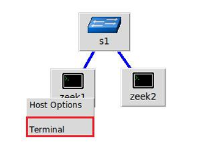

# DOC API Zeek with mininet : 
## Set up 
### Import the project with git : 
```bash 
cd /home/p4
git clone https://github.com/clementperrotaimvp/api_zeek.git
cd api_zeek
```


### Create Mininet architecture
```bash
#on the main host
sudo mn -c #cleanup 
miniedit #mininet editor 
#then create manually the simple architechture like the picture bellow (rename h1 and h2 : zeek1 and zeek2)
```


### Set up the Zeek interface 

**Objective** : Enable Zeek on the host zeek2 (We have to change the interface because eth0 is already use)

```bash
sudo nano /usr/local/zeek/etc/node.cfg
#change interface=eth0 to interface=lo
sudo /usr/local/zeek/bin/zeekctl cleanup
sudo /usr/local/zeek/bin/zeekctl deploy
sudo /usr/local/zeek/bin/zeekctl start
```

### Set up FASTAPI on zeek2 

**Objective** : Install FASTAPI on Zeek Server (zeek2)

1. Import all the dependencies needed for FastAPI/uvicorn

We use **pip download** to obtain a .whl package, allowing us to install the required pip module on the network-isolated host zeek2.

```bash 
#On the main host 
cd /home/p4 
pip download anyio-3.6.2-py3-none-any.whl
pip download click-8.1.3-py3-none-any.whl
pip download colorama-0.4.6-py2.py3-none-any.whl
pip download fastapi-0.92.0-py3-none-any.whl
pip download h11-0.14.0-py3-none-any.whl
pip download idna-3.4-py3-none-any.whl
pip download pydantic-1.10.5-cp310-cp310-win_amd64.whl
pip download sniffio-1.3.0-py3-none-any.whl
pip download starlette-0.25.0-py3-none-any.whl
pip download typing_extensions-4.5.0-py3-none-any.whl
pip download uvicorn-0.20.0-py3-none-any.whl
```
Paquet for DOS attack : 
```bash 
sudo apt install hping3
```

2. Set up the modules on host zeek2 
```bash
#On the host zeek2 
cd /home/p4
pip install *.whl 
```
All modules are installed without requiring network access.

### Launch the API server on host zeek2

Access to zeek2 terminal with miniedit interface

```bash
#On the host zeek2 
cd /home/p4/api_zeek
/home/p4/.local/bin/uvicorn main:app --reload --host 0.0.0.0 --port 8000
```

Keep this terminal open

## Experiment

1. Open 2 terminal of zeek1 instance with miniedit interface

2. Launch API call on the first zeek1 terminal 
```bash 
#On the host zeek2 
cd /home/p4/api_zeek
python3 call_api.py
```

3. Immediately Send a DOS attack from zeek1 terminal to zeek2 
```bash 
#On the host zeek2 
sudo hping3 -S --flood -V -p 80 10.0.0.2
```
Wait 10 secondes and kill the command with Ctrl+C

4. Wait the result which will be receive on the first zeek1 terminal

The returned message is in a json format. It contains the list of the IP and the number of paquet sent by this IP address order by number desc. 


## After experiment : Stop Services Server on zeek2 host
1. Stop Zeek
```bash
sudo /usr/local/zeek/bin/zeekctl stop 
```

2. Ctrl+C on zeek2 terminalto stop API server
